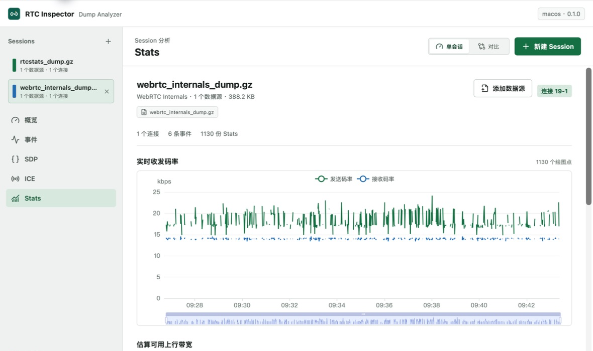
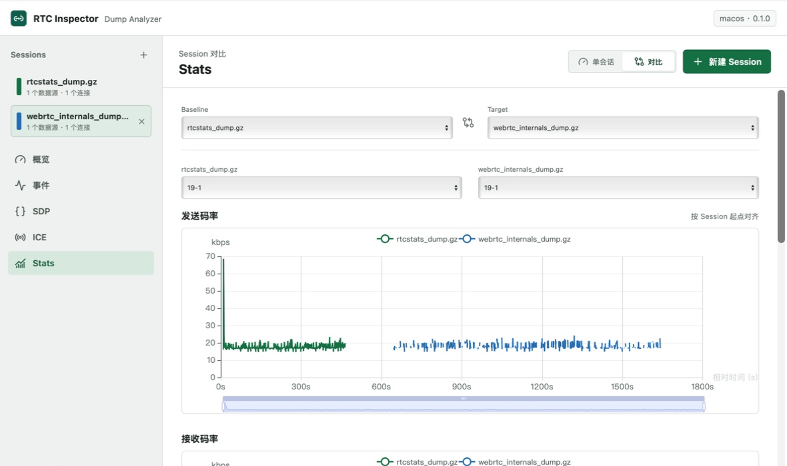

# RTC Inspector

轻量、离线优先的 WebRTC Dump 分析桌面工具。

RTC Inspector 使用 Tauri 2 和 Rust 在本机解析 `webrtc-internals`、`rtcstats` 日志，并通过 React 与 ECharts 展示连接状态、SDP、ICE 候选和媒体质量趋势。日志不会上传到远程服务。



## 核心能力

- **双格式解析**：自动识别 `webrtc-internals` 与 `rtcstats`，支持原始文件和 gzip 压缩文件
- **连接诊断**：汇总 PeerConnection、信令、ICE、媒体方向、编解码器和异常事件
- **ICE 分析**：查看本地与远端候选、候选类型、选中候选对、RTT 和可用上行带宽
- **趋势图表**：展示发送/接收码率、丢包、帧率、RTT 和带宽变化
- **Session 聚合**：将同一通话的多份日志合并为一个分析 Session，并对重复数据去重
- **Session 对比**：并排比较两个 Session 的概览、事件、SDP、ICE 和 Stats
- **离线处理**：Rust parser 在本地运行，不依赖分析服务或云端接口

## Session 对比

不同时间导入的日志可以创建为独立 Session。选择 Baseline 与 Target 后，Stats 会按照各 Session 的相对起点对齐，便于观察码率、RTT 和带宽差异。



## 支持的输入

| 输入 | 常见文件名 | 压缩格式 | 主要数据 |
| --- | --- | --- | --- |
| Chrome WebRTC Internals | `webrtc_internals_dump` | 原始文件、`.gz` | API 事件、SDP、ICE、Stats |
| rtcstats | `rtcstats_dump` | 原始文件、`.gz` | API 事件、SDP、ICE、Stats |

解析器根据文件内容识别格式，不依赖固定文件名。无法识别、文件损坏或部分数据异常时，界面会显示结构化错误，不影响其他数据源和 Session。

## 使用方式

1. 点击“新建 Session”，选择一份或多份属于同一通话的日志。
2. 使用“添加数据源”向当前 Session 补充另一种格式的日志。
3. 在左侧切换“概览、事件、SDP、ICE、Stats”分析视图。
4. 创建第二个 Session 后，切换到“对比”并选择 Baseline 与 Target。

同一 Session 中具有相同 PeerConnection ID 的数据会自动聚合。重复 SDP、ICE 候选、候选对、事件和 Stats 会去重，同时保留原始数据源列表。

## 分析视图

| 视图 | 内容 |
| --- | --- |
| 概览 | 文件格式、数据源、持续时间、连接状态、媒体和网络摘要 |
| 事件 | PeerConnection API 调用与状态变化时间线 |
| SDP | Local/Remote Offer、Answer 和 SDP 原文 |
| ICE | 候选、候选类型、选中路径、RTT 和可用带宽 |
| Stats | 码率、丢包、帧率、RTT 和可用上行趋势 |

当日志未直接记录 ICE gathering 状态，但已经存在候选及选中候选对时，RTC Inspector 会显示 `complete（推断）`，避免将有效 ICE 数据误判为“无记录”。

## 数据流

```text
系统文件选择器
      |
      v
Tauri Command
      |
      v
Rust dump-reader
      |
      +-- adapter-rtcstats
      +-- adapter-internals
      |
      v
统一 RTC Domain Model
      |
      v
Session 聚合与去重
      |
      v
React 工作台 + ECharts
```

Rust 负责文件读取、gzip 解压、格式识别、解析和基础连接分析。React 前端负责 Session 工作区、数据源聚合、单 Session 查看和跨 Session 对比。

## 隐私

- 日志仅在本地桌面进程中读取和解析
- 当前版本不包含遥测、账号系统或远程日志上传
- README 截图避开 SDP 和 ICE 候选地址，不包含真实 IP
- 分享截图或日志前，仍建议检查 SDP、候选地址、页面 URL 和设备信息

## 技术栈

| 层级 | 技术 |
| --- | --- |
| 桌面容器 | Tauri 2、WRY、系统 WebView |
| Parser | Rust、Serde、flate2 |
| 前端 | React 19、TypeScript、Vite |
| 图表 | Apache ECharts |
| 测试 | Rust Test、Vitest、Testing Library |

Tauri 使用操作系统提供的 WebView，不会像 Electron 一样将完整 Chromium 内核打入安装包。

## 环境要求

- Node.js 20+
- npm 10+
- Rust stable（当前验证版本为 1.98）
- macOS：Xcode Command Line Tools
- Windows：Microsoft C++ Build Tools、WebView2 Runtime

## 开发运行

```bash
npm install
npm run dev
```

该命令会启动 Vite 开发服务和 Tauri 桌面窗口。前端开发服务默认使用 `http://localhost:1420/`；文件导入必须在 Tauri 桌面窗口中操作。

需要代理安装依赖时，可在当前终端配置自己的代理地址：

```bash
export https_proxy=http://proxy.example:7897
export http_proxy=http://proxy.example:7897
export all_proxy=socks5://proxy.example:7897
export NO_PROXY=localhost
```

## 质量检查

```bash
npm run check
npm run test
npm run build
cargo fmt --all -- --check
cargo test --workspace
cargo clippy --workspace --all-targets -- -D warnings
```

## 构建安装包

macOS：

```bash
npm run tauri:build
```

macOS 产物：

```text
target/release/bundle/macos/RTC Inspector.app
target/release/bundle/dmg/RTC Inspector_<version>_aarch64.dmg
```

Windows 需要在 Windows 环境中执行相同命令，生成对应的 NSIS 或 MSI 安装包。

## 项目结构

```text
apps/desktop/                     React、TypeScript、Vite 前端
apps/desktop/src-tauri/           Tauri 桌面入口、命令和应用资源
assets/screenshots/               不含敏感地址的界面截图
crates/rtc-domain/                WebRTC 领域模型与连接分析
crates/dump-reader/               文件读取、gzip 解压和格式分派
crates/adapter-rtcstats/          rtcstats dump 解析器
crates/adapter-internals/         webrtc-internals dump 解析器
```

## 当前边界

- Session 保存在应用内存中，退出应用后不会恢复
- 一次对比选择一个 Baseline 和一个 Target
- Stats 按 Session 相对起点对齐，不执行跨设备绝对时钟校正
- 外部 Chrome CDP、内嵌 H5 SDK 和 WebRTC 重协商链路分析尚未接入
